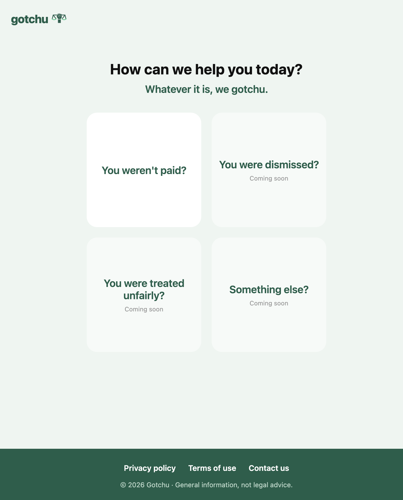
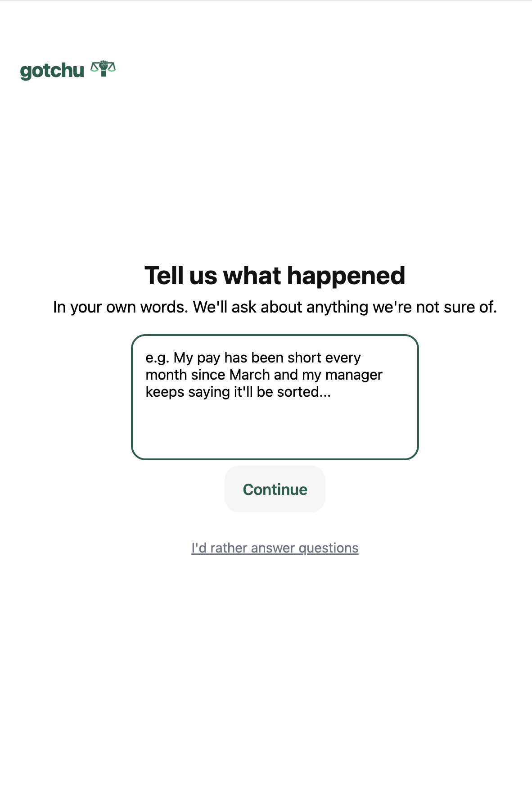
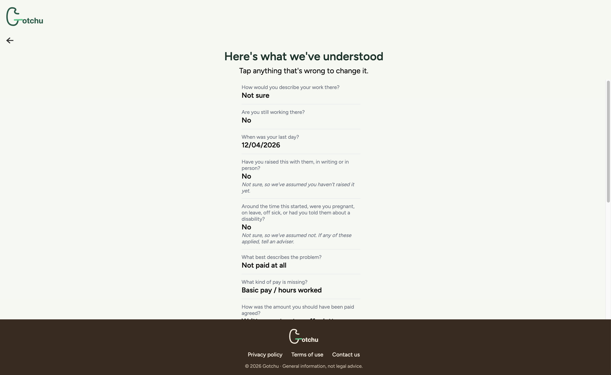
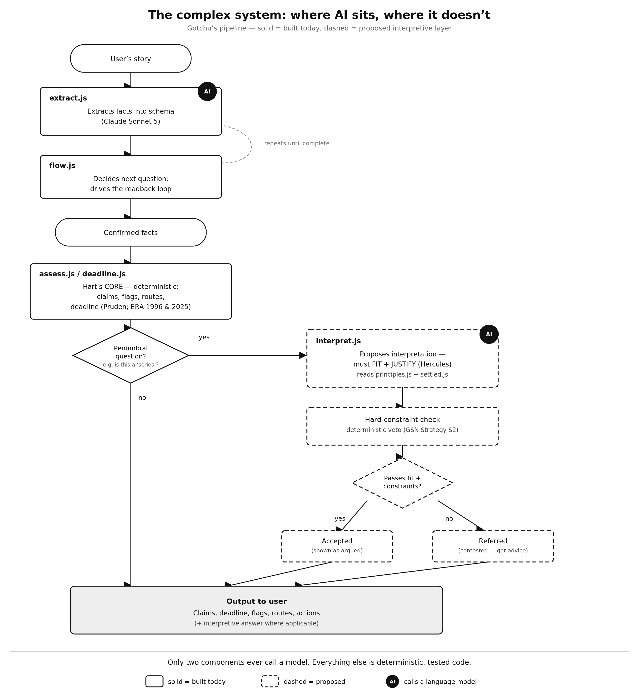

# Gotchu

**Plain-language legal help for people with a workplace problem, starting with unpaid wages in England and Wales.**

Most people with a legal right never use it: the law looks too confusing, too expensive, or too slow, and deadlines pass before they find help. Gotchu lets someone describe their problem in their own words, works out where they stand, tells them the deadline that applies to them, and drafts the first letter to their employer.

> This page is a showcase. The source code is private and available to view on request.
> Gotchu is a research prototype: general information, not legal advice.

  
  
  

## How it works

1. **Tell us what happened.** The user writes their story in plain words, or answers questions instead.
2. **AI extracts facts, and only facts.** A language model fills in a fixed form from the story. It never decides the law. Every date it returns must quote the exact words it came from, and a validator rejects anything that is not in the story, not in the form, or a guessed date.
3. **The user checks it.** A readback screen shows what was understood and where each answer came from (*you*, *your story*, or *assumed*), and anything can be changed.
4. **A rules engine decides.** Ordinary code, not AI, applies the law: whether a deduction looks unlawful, which routes are open (employer, Acas, HMRC, tribunal), any warning signs, and the exact Acas Early Conciliation deadline, including the change from three months to six for incidents on or after 1 October 2026.
5. **Next steps.** A plain-English assessment, the deadline, and a draft letter to the employer.

## Built to be safe

The engine follows hard rules, each checked by automated tests:

- The deadline shown is never later than the strictest lawful reading of the facts (ERA 1996 s.23(2)).
- A deduction is never shown as lawful unless written consent has been confirmed (ERA 1996 s.13).
- A warning sign, such as possible discrimination or retaliation, can be raised by the story but never ruled out by it.
- "I'm not sure" always falls back to the answer that protects the user, and the app says so.

## Testing and verification

- **100 automated tests** across the rules engine.
- **Exhaustive deadline check:** every incident date from 2016 to 2036 (7,671 dates) is compared with an independent implementation of the same rule.
- **Property-based tests** generate thousands of complete sets of facts and check the safety rules hold for every one.
- **Extraction personas:** scripted stories run through the AI layer to measure how often it misses facts or states something wrongly with confidence.
- **Law lockfile:** every provision the engine relies on is pinned to the text last reviewed; a checker re-fetches it from legislation.gov.uk and flags changes and pending amendments.
- **Legal review pack:** generated automatically, setting out every question the app asks and why, for a lawyer to check.

## Tech

React Native and Expo (iOS, Android and web) · JavaScript · Jest and fast-check · a Cloudflare Worker that keeps the API key on the server and calls Claude for fact extraction.

## Roadmap

- More employment problems: dismissal, unfair treatment, holiday pay.
- Lawyer review of the unpaid-wages rules before any public release.
- Connecting users to advisers (Citizens Advice, law centres, unions) with their facts ready to share.
- Connecting to lawyers that would verify code that constitute rules (in a simple manner as the app generates the legal rules applied and what they do)

## Author

**Oliwier Rokicki-Tyszka**, law graduate (LLB, Sheffield; LLM, LSE) and former student legal adviser at the LSE Employment Law Clinic. I built Gotchu to learn to code and to test whether the law can be made usable by the people it is meant to protect.

Contact: orokickityszka@gmail.com · [LinkedIn](https://linkedin.com/in/orokickityszka)
